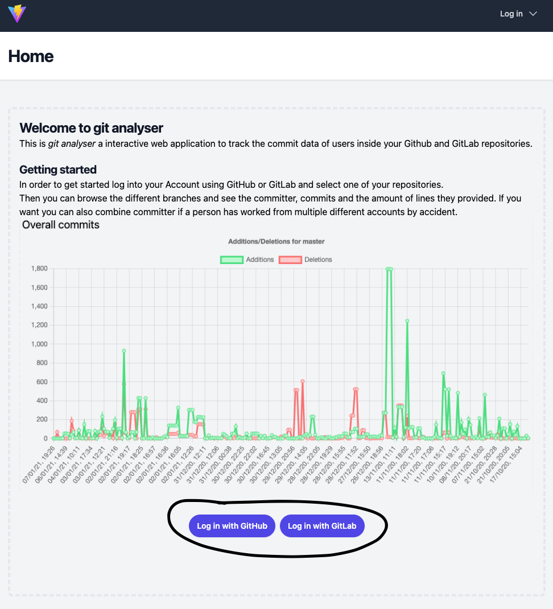
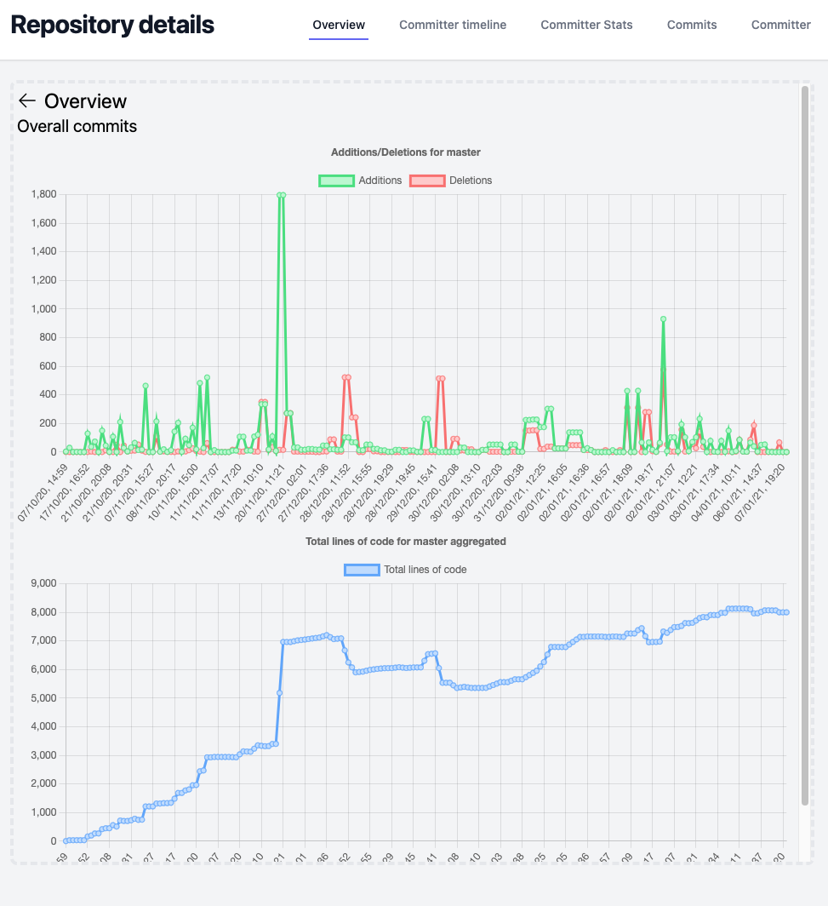
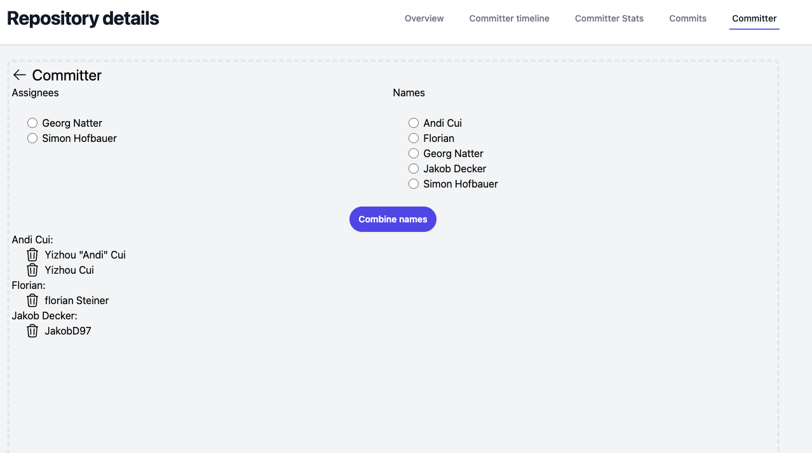

# Feature guide

## Login

Git analyser supports login via GitHub or GitLab. Select one and you will be redirected to the corresponding login interface

## Dashboard

After login the dashboard helps the user to find the relevant repository.

## Project overview

After selecting a project the user is shown all available branches and should select one to view in more detail.

## Repository details

### Overview 

When a branch is selected the overall stats for the branch are shown in the form of all commits and their additions and deletions as well as the change of the total lines of code.

### Committer timeline

Similar to the overview the committer timeline shows the additions and deletions of the branch but seperated for each person.

### Committer Stats

The committer stats show the contributions by different people in a pie chart to make it simpler to compare effort in projects.

### Commits

The commits tab gives a simple overview over all commits on this branch.

### Committer

The committer feature allows for combining of different people to be used as one. After names are combined the combined name will be used in all other features to show the stats correctly if a person has used multiple accounts to contribute.

#### How to combine

In order to combine people select one of the left names. Then select the name you want to give this person by selecting another committer on the right.
To finalize this click on combine names.

When the names where combined correctly the result will be shown below the combine names button.

#### How to unlink

If you miss clicked you can unlink a name combination by clicking on the trash icon beside the relevant name. Once again the UI will update with the result.